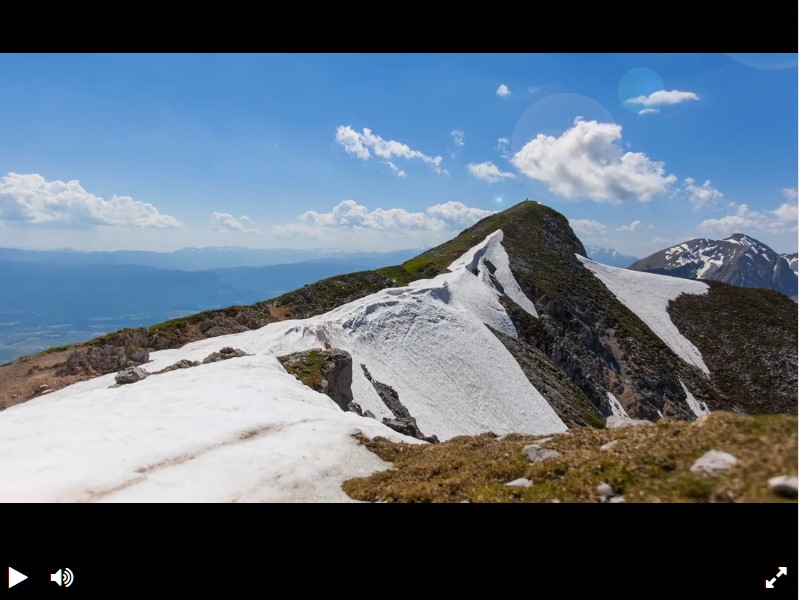

Это проект онлайн проигрывателя видео, написанный на данной [библиотеке](https://github.com/devmanorg/video-player-jslib).

Рабочую версию онлайн проигрывателя вы можете пощупать [здесь.](https://maxim-pekov.github.io/player-layout/)



## В плеере присутствут кнопки:

* Запуска.
* После нажатия на кнопку запуска, она сменяется кнопкой паузы.
* Кнопка выключения/включения звука
* Кнопка полноэкранного просмотра видео
* Прогресс бар с указанием текщего времени видео и длительностью.


## Установка

Используйте данную инструкцию по установке этого скрипта

1. Установить

```python
git clone https://github.com/Maxim-Pekov/player-layout.git
```

2. Создайте виртуальное окружение:

```python
python - m venv venv
```

3. Активируйте виртуальное окружение:

```python
.\venv\Scripts\activate`  # for Windows
```

```python
source ./.venv/bin/activate  # for Linux
```

4. Перейдите в `player-layout` директорию.

3. Установите зависимости командой ниже:

```python
pip install - r requirements.txt
```

4. Запустите плеер открыв в браузере файл index.html

## About me

[https://www.linkedin.com/in/maxim-pekov/](https://www.linkedin.com/in/maxim-pekov/)
</br>

[https://t.me/MaxPekov/](https://t.me/MaxPekov/)
</br>

[//]: # (Карточка профиля: )


[//]: # (Статистика языков в коммитах:)

[//]: # (Статистика языков в репозиториях:)


[//]: # (Статистика профиля:)

[//]: # (Данные по коммитам за сутки:)


[//]: # ([![trophy]&#40;https://github-profile-trophy.vercel.app/?username=Maxim-Pekov&#41;]&#40;https://github.com/ryo-ma/github-profile-trophy&#41;)
